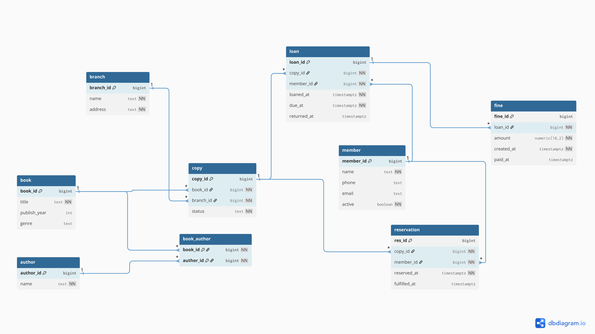

# City Library Management System

A PostgreSQL schema for a multi-branch city library — books, copies, loans, reservations, and fines — where the business rules live **inside the database**, not in application code: partial unique indexes, temporal `CHECK` constraints, and triggers that enforce them and keep everything consistent.

Built and verified against a live PostgreSQL 16 instance throughout — every trigger and constraint mentioned below was actually run and checked, not just written.

## Quick start

```bash
docker compose up
```

PostgreSQL 16 starts and the files in `sql/` run automatically, in order (schema → triggers → views/functions → seed data).

```
host: localhost
port: 5432
db:   city_library
user: library_admin
pass: library_pass
```

## Entity-Relationship Diagram



## Schema

9 tables: `branch`, `member`, `author`, `book`, `book_author` (M:M), `copy`, `loan`, `reservation`, `fine`.

Normalized to 3NF. The one cached/derived value (`copy.status`) is kept consistent purely through triggers, never touched directly by the seed data or application code.

## Business rules enforced in the database

| Rule | Enforced by |
|---|---|
| A copy can only be on one open loan at a time | Partial unique index `uq_copy_single_open_loan` |
| A member can't double-reserve the same copy | Partial unique index `uq_reservation_open_per_member` |
| Only one fine per loan | Partial unique index `uq_fine_one_per_loan_idx` |
| A loan/reservation/fine can't have an end date before its start date | `CHECK` constraints on `loan`, `reservation`, `fine` |
| `copy.status` stays in sync with loans and reservations | `AFTER INSERT` / `AFTER UPDATE` triggers |
| A late return automatically generates a fine ($1.50/day late) | `AFTER UPDATE OF returned_at` trigger on `loan` |
| Can't loan out a copy that's already on loan, or reserved for someone else | `BEFORE INSERT` trigger on `loan` |
| Can't take a new loan with more than $20 in unpaid fines | Same `BEFORE INSERT` trigger |

## Views & functions

- **`v_overdue_loans`** — every open loan currently past its due date, with how overdue it is
- **`v_member_activity`** — per-member active/total loan counts and unpaid fine balance
- **`renew_loan(loan_id, extra_days DEFAULT 14)`** — extends a loan's due date; raises an exception if another member has a pending reservation on that copy, or if the loan was already returned

## Demo

```sql
-- Try to loan a copy that's already checked out:
INSERT INTO loan(copy_id, member_id) VALUES (21, 5);
-- ERROR:  Copy 21 is already on loan

-- Reserve a copy that's currently on loan (this is normal — that's
-- the point of a reservation) — the copy correctly stays 'on_loan',
-- it doesn't jump straight to 'reserved':
INSERT INTO reservation(copy_id, member_id) VALUES (21, 8);
SELECT status FROM copy WHERE copy_id = 21;
--  status
-- ----------
--  on_loan

-- Renew an open loan with no competing reservation:
SELECT renew_loan(21);
--          renew_loan
-- -------------------------------
--  2026-09-12 17:01:10.302335+00

-- Renew a loan that DOES have a competing reservation from someone else:
SELECT renew_loan(19);
-- ERROR:  Cannot renew loan 19: another member has a pending
--         reservation on this copy
```

## Engineering notes

A few real bugs turned up while building and testing this against a live database — worth documenting because they're not the kind of thing you catch by reading the SQL, only by running it:

- **A window function inside `UPDATE...SET`** isn't legal in PostgreSQL (`row_number() OVER (...)` needs a `SELECT` context) — fixed by computing barcodes inline at insert time instead of backfilling them afterward.
- **A trigger that unconditionally overwrote `copy.status` to `'reserved'` on any new reservation** — even if the copy was currently on loan to someone. Reserving a copy that's on loan is normal (that's the whole point of a reservation), but the old logic silently lost the fact that the copy was still out with a borrower. Fixed by only flipping the status when the copy is currently `'available'`; the return trigger already knows to route a returned copy to `'reserved'` instead of `'available'` when there's a pending reservation waiting.
- **Temporal integrity wasn't enforced at all** — nothing stopped a loan's `returned_at` from being earlier than its `loaned_at`, or a fine being marked paid before it was created. Added `CHECK` constraints for all four date pairs across `loan`, `reservation`, and `fine`.
- **A `LATERAL` subquery that looked random but wasn't** — the book/author seeding used `CROSS JOIN LATERAL (SELECT author_id FROM author ORDER BY random() LIMIT ...)` intending a different random set of authors per book. But the subquery never actually referenced the outer `book` row, so it wasn't truly correlated — Postgres' planner is free to evaluate an uncorrelated subquery once and reuse that single result for every row, which is exactly what happened: all 25 books silently ended up with the identical 3 authors. This surfaced immediately when querying "top authors by book count" returned only 2 authors out of 20. Fixed by ordering on `md5(book_id || author_id)` instead of `random()`, which genuinely depends on the outer row (and is reproducible, not just "random").

## Repo structure

```
.
├── docker-compose.yml
├── sql/
│   ├── 01_schema.sql              -- tables, indexes, CHECK constraints
│   ├── 02_triggers.sql            -- business-rule triggers
│   ├── 03_views_and_functions.sql -- reporting views + renew_loan()
│   └── 04_seed.sql                -- ~20-50 rows per table
├── queries/
│   └── queries.sql                -- sample queries (SELECT/WHERE, JOIN, GROUP BY, HAVING, subqueries)
└── docs/
    ├── ERD.pdf
    └── ERD.png
```

## Seed data

| Table | Rows |
|---|---|
| branch | 15 |
| member | 25 |
| author | 20 |
| book | 25 |
| book_author | 50 |
| copy | 45 |
| loan | 30 |
| reservation | 20 |
| fine | ~7 (generated organically, see below) |

Two things worth calling out:

- **Loan returns are performed as real `UPDATE`s** during seeding, not baked into the initial `INSERT`. That means `fine_on_late_return` actually fires and generates the `fine` rows as a side effect of seeding — the fine count above isn't a fixed target, it's whatever the trigger genuinely produces from the mix of on-time and late returns. A padded, arbitrary fine count would misrepresent what the trigger does.
- **Reservations are assigned by `copy_id` deterministically**, independent of whether that copy currently has an open loan. That's both more realistic (you can reserve a copy that's checked out) and guarantees an exact, reproducible reservation count on every run — it doesn't depend on how many copies happen to be free after the random loan/return mix, the way an earlier version of this seed script did.

## Tech

PostgreSQL 16 · Docker Compose
